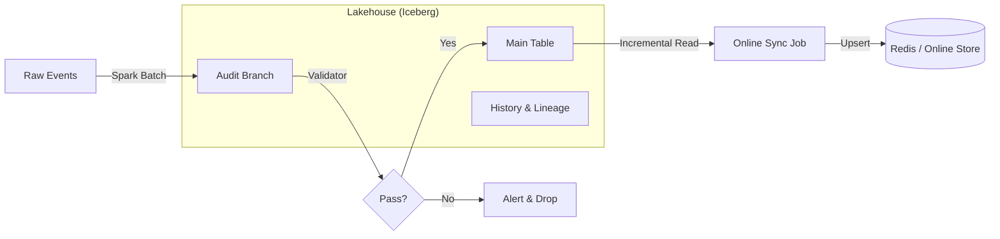

# Offline Feature Backfill Platform (Lakehouse Architecture)

A production-ready Offline Feature Platform built on **Apache Iceberg** and **Spark**, featuring **Time-Travel**, **WAP (Write-Audit-Publish)** governance, and **Batch-Stream Consistency**.


## 🚀 Core Features

### 1. 🛡️ Data Governance & Quality (WAP)
Zero dirty data in production. We use the **Write-Audit-Publish** pattern:
*   **Write**: Backfill jobs write to an isolated `audit` branch.
*   **Audit**: Automated validation checks data distribution and null rates on the branch.
*   **Publish**: Only if validation passes, the data is atomically "fast-forwarded" to `main`.

### 2. 🕰️ Reproducibility (Time Travel + Lineage)
Every row is traceable to the exact code that produced it.
*   **Code-Data Binding**: Every Iceberg snapshot includes the **Git Commit Hash** and **Run ID** in its metadata.
*   **Time Travel**: Query data exactly as it existed at any point in the past.
    ```sql
    SELECT * FROM features FOR SYSTEM_VERSION AS OF '2023-01-01 10:00:00'
    ```

### 3. ⚡️ Batch-Stream Consistency
*   **Single Source of Truth**: Iceberg serves as the master store for historical feature correctness.
*   **Incremental Sync**: `OnlineSyncJob` reads validated deltas from Iceberg and upserts them to the Online Store (Redis), ensuring serving data matches offline training data.

## 🏗️ Architecture



## 📂 Project Structure

```
offline_data_infra/
├── src/
│   ├── jobs/
│   │   ├── backfill_job.py    # Main WAP Engine (Compute -> Validate -> Commit)
│   │   ├── online_sync_job.py # Pushes validated features to Redis
│   │   └── maintenance_job.py # Compaction & Snapshot Expiration
│   ├── features/              # Feature logic definitions
│   └── validation/            # Data quality checks
├── docs/                      # Detailed Architecture Documentation
└── notebook/                  # Exploration notebooks
```

## 🚦 Quick Start

### Prerequisites
*   Java 8, 11, or 17 (Required for Spark)
*   Python 3.8+

### 1. Installation
```bash
# Install dependencies
pip install -r requirements.txt
```

### 2. Run Backfill (The "Compute" Phase)
This runs the full **WAP** lifecycle: Generates mock data, writes to a branch, validates, and publishes if safe.
```bash
./run_backfill.sh --start_date 2023-01-01 --end_date 2023-01-02
```

### 3. Sync to Online Store (The "Serve" Phase)
Incrementally pushes the new offline features to the online serving layer (mock Redis).
```bash
./run_sync.sh
```

### 4. Maintenance (The "Optimize" Phase)
Keep the Lakehouse fast by compacting small files and expiring old history.
```bash
./run_maintenance.sh --days 7
```

## 📖 Documentation
See [Architecture Guide](docs/architecture.md) for deep dives into:
*   Iceberg Branching Strategies
*   Snapshot isolation mechanics
*   Schema evolution rules
