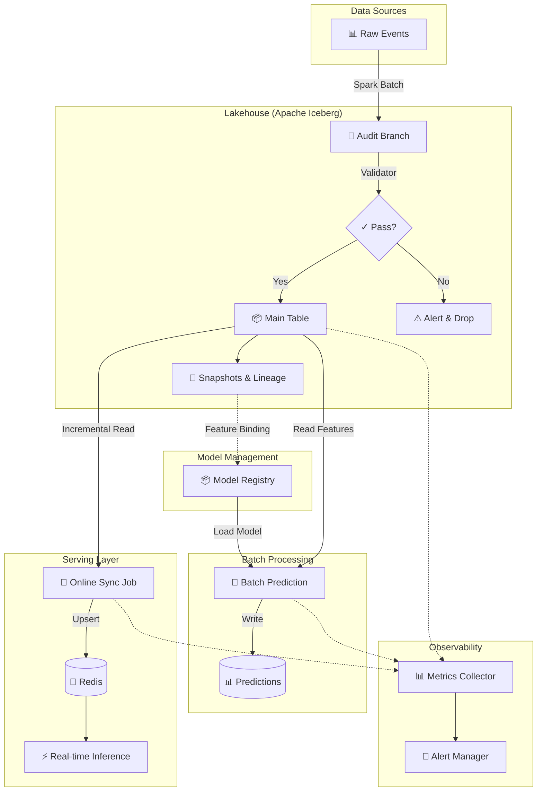

<div align="center">

# 🏗️ Offline Feature Backfill Platform

### Production-Grade Lakehouse Architecture for Feature Engineering

[](https://www.python.org/downloads/)
[](https://spark.apache.org/)
[](https://iceberg.apache.org/)
[](LICENSE)

*A unified offline feature platform built on **Apache Iceberg** + **Spark**, delivering **Time-Travel Reproducibility**, **WAP Governance**, and **Batch-Stream Consistency** for ML Feature Stores.*

[Features](#-core-features) • [Architecture](#-architecture) • [Quick Start](#-quick-start) • [Documentation](#-documentation)

</div>

---

## ✨ Why This Platform?

| Challenge | Our Solution |
|-----------|--------------|
| 🚫 Dirty data polluting production | **WAP (Write-Audit-Publish)** isolates writes, validates before commit |
| 🔍 "Which code produced this feature?" | **Code-Data Lineage** binds Git hash + Run ID to every snapshot |
| ⏰ "What did the data look like last week?" | **Time Travel** queries any historical state instantly |
| 🔄 Training/Serving skew | **Single Source of Truth** with incremental Online Store sync |

---

## 🚀 Core Features

### 1. 🛡️ Data Governance & Quality (WAP Pattern)

**Zero dirty data in production.** The Write-Audit-Publish pattern ensures data quality at the gate:

```
┌──────────────────┐     ┌──────────────────┐     ┌──────────────────┐
│  📝 WRITE        │ ──▶ │  🔍 AUDIT        │ ──▶ │  ✅ PUBLISH      │
│  Isolated Branch │     │  Auto Validation │     │  Fast-Forward    │
└──────────────────┘     └──────────────────┘     └──────────────────┘
```

- **Write**: Backfill jobs write to an isolated `audit_<run_id>` branch
- **Audit**: Automated checks validate data distribution, null rates, and business rules
- **Publish**: Only validated data is atomically fast-forwarded to `main`

### 2. 🕰️ Full Reproducibility (Time Travel + Lineage)

Every row is traceable to the exact code, run, and time that produced it:

```sql
-- Query historical state
SELECT * FROM features FOR SYSTEM_VERSION AS OF '2023-01-01 10:00:00'

-- See full lineage
SELECT committed_at, 
       summary['spark.snapshot-property.code-version'] as git_hash,
       summary['spark.snapshot-property.run-id'] as run_id 
FROM features.snapshots
```

**Metadata Injected:**
- ✅ Git Commit Hash
- ✅ Unique Run ID  
- ✅ Pipeline User
- ✅ Timestamp

### 3. ⚡ Batch-Stream Consistency

No more training/serving skew:

- **Single Source of Truth**: Iceberg serves as the master store for historical correctness
- **Incremental Sync**: `OnlineSyncJob` reads validated deltas and upserts to Redis
- **Snapshot-based Delta**: Uses `start-snapshot-id` for efficient incremental reads

### 4. 🔧 Self-Maintaining Lakehouse

Automated optimization keeps your data lake fast:

| Operation | Purpose | Default |
|-----------|---------|---------|
| `rewrite_data_files` | Compact small files | Auto |
| `expire_snapshots` | Reclaim storage | 7 days |
| `remove_orphan_files` | Clean unreferenced files | Auto |

---

## �️ Architecture



<div align="center">

<br/>
<em>Complete ML Feature Platform: Data Ingestion → Lakehouse → Model Registry → Batch/Online Serving → Observability</em>
</div>

---

## 📂 Project Structure

```
offline_data_infra/
├── 📜 README.md                     # You are here
├── 📋 requirements.txt              # Python dependencies
│
├── 🚀 run_backfill.sh               # Execute WAP pipeline
├── 🔄 run_sync.sh                   # Sync to online store
├── 🔧 run_maintenance.sh            # Optimize & cleanup
├── 🤖 run_batch_predict.sh          # Batch inference job
├── 📦 run_registry_demo.sh          # Model Registry demo
├── 📊 run_monitoring_demo.sh        # Monitoring demo
│
├── src/
│   ├── jobs/
│   │   ├── backfill_job.py          # 🏭 Main WAP Engine
│   │   │                            #    Compute → Validate → Commit
│   │   ├── online_sync_job.py       # 🔄 Incremental Redis Sync
│   │   ├── maintenance_job.py       # 🧹 Compaction & Expiration
│   │   └── batch_predict_job.py     # 🤖 Spark Batch Inference
│   │
│   ├── model/                       # 📦 Model Management
│   │   └── registry.py              # Model Registry with Lineage
│   │
│   ├── monitoring/                  # 📊 Observability
│   │   ├── metrics.py               # Prometheus Metrics Collector
│   │   └── alerts.py                # Alerting Engine & Rules
│   │
│   ├── features/
│   │   └── user_features.py         # 📊 Feature Definitions
│   │
│   ├── validation/
│   │   └── validator.py             # ✅ Data Quality Rules
│   │
│   ├── serving/
│   │   └── online_store.py          # 🚀 Redis Client Wrapper
│   │
│   └── common/
│       ├── spark_utils.py           # 🔧 Spark Session Factory
│       └── git_utils.py             # 🔗 Git Lineage Utils
│
├── docs/
│   └── architecture.md              # 📖 Deep Dive Documentation
│
├── model_registry/                  # 📁 Model Artifacts & Metadata
├── tests/                           # 🧪 Test Suite
└── warehouse/                       # 📁 Local Iceberg Warehouse
```

---

## 🚦 Quick Start

### Prerequisites

| Requirement | Version | Notes |
|-------------|---------|-------|
| Java | 8, 11, or 17 | Required for Spark |
| Python | 3.8+ | Tested on 3.9, 3.10 |
| pip | Latest | For dependency management |

### Installation

```bash
# Clone the repository
git clone https://github.com/yourusername/offline_data_infra.git
cd offline_data_infra

# Install dependencies
pip install -r requirements.txt
```

### Run the Pipeline

#### Step 1: Backfill (Compute Phase)
Runs the full **WAP** lifecycle: generates data → writes to audit branch → validates → publishes if safe.

```bash
./run_backfill.sh --start_date 2023-01-01 --end_date 2023-01-02
```

**Expected Output:**
```
Starting Backfill. RunID: a1b2c3d4, Commit: abc1234
Computing features for user_features...
Creating Audit Branch: audit_a1b2c3d4
Validation PASSED. Fast-forwarding main to audit branch...
Successfully Published to Main!
```

#### Step 2: Online Sync (Serve Phase)
Incrementally pushes validated features to the online serving layer.

```bash
./run_sync.sh
```

#### Step 3: Maintenance (Optimize Phase)
Keeps the Lakehouse performant with automatic cleanup.

```bash
./run_maintenance.sh --days 7
```

#### Step 4: Batch Prediction (Inference Phase)
Run batch inference using models from the Model Registry.

```bash
# Mock mode for demo (no real model required)
./run_batch_predict.sh --mock

# With a registered model
./run_batch_predict.sh --model_name user_ctr_model
```

---

## 📦 Model Registry

Centralized model versioning with **feature-data lineage binding**:

```python
from src.model.registry import ModelRegistry

registry = ModelRegistry()

# Register model with feature snapshot binding
version = registry.register_model(
    name="user_ctr_model",
    model_path="./model.pkl",
    metrics={"auc": 0.92, "f1": 0.85},
    feature_snapshot_id="snap_abc123",  # Iceberg snapshot used for training
    git_commit_hash="abc1234"
)

# Promote to production
registry.promote_to_production("user_ctr_model", version.version)

# Get lineage for reproducibility
lineage = registry.get_model_lineage("user_ctr_model", "1.0.0")
```

**Key Features:**
- ✅ Semantic versioning (1.0.0, 1.0.1, ...)
- ✅ Feature snapshot binding (Iceberg integration)
- ✅ Model lifecycle (staging → production → archived)
- ✅ Artifact storage and hash verification
- ✅ Full lineage tracking (code + data)

```bash
# Run demo
./run_registry_demo.sh
```

---

## 📊 Monitoring & Alerting

Production-grade observability with Prometheus-compatible metrics:

```python
from src.monitoring.metrics import MetricsCollector
from src.monitoring.alerts import AlertManager, create_default_alert_rules

# Collect metrics
collector = MetricsCollector("ml_platform")
collector.record_prediction_latency(0.05)
collector.record_feature_null_rate("user_id", 0.01)
collector.record_job_success("backfill")

# Export to Prometheus format
print(collector.export_prometheus())

# Set up alerting
manager = AlertManager()
for rule in create_default_alert_rules():
    manager.add_rule(rule)

# Evaluate and fire alerts
fired = manager.evaluate_all(collector)
```

**Pre-built Alert Rules:**
| Alert | Threshold | Severity |
|-------|-----------|----------|
| `high_feature_null_rate` | > 10% | ⚠️ Warning |
| `prediction_latency_high` | P99 > 500ms | 🔴 Error |
| `job_failure_spike` | > 3 failures | 🚨 Critical |
| `feature_drift_detected` | Drift score > 0 | ⚠️ Warning |
| `model_too_old` | > 1 week | ℹ️ Info |

```bash
# Run demo
./run_monitoring_demo.sh
```

---

## 📊 Key Technologies

| Component | Technology | Purpose |
|-----------|------------|---------|
| Storage | Apache Iceberg | ACID transactions, time travel, branching |
| Compute | Apache Spark 3.5 | Distributed feature computation |
| Online Store | Redis | Low-latency feature serving |
| Lineage | Git Integration | Code-data binding |

---

## 📖 Documentation

| Document | Description |
|----------|-------------|
| [Architecture Guide](docs/architecture.md) | Deep dive into system design |

### Topics Covered:
- 🌿 Iceberg Branching Strategies
- 📸 Snapshot Isolation Mechanics  
- 🔄 Schema Evolution Rules
- 📈 Performance Tuning Guide

---

## 🗺️ Roadmap

**Completed ✅:**
- [x] **Model Registry** - Centralized model versioning with feature lineage
- [x] **Batch Prediction** - Spark-based batch inference pipeline
- [x] **Monitoring & Alerting** - Prometheus metrics + rule-based alerts

**In Progress 🔄:**
- [ ] **Grafana Dashboards** - Pre-built dashboard templates
- [ ] **Feature SDK** - Python DSL for feature definitions
- [ ] **Schema Registry Integration** - Automated schema evolution validation
- [ ] **Kubernetes Deployment** - Helm charts for production

---

## 🤝 Contributing

Contributions are welcome! Please feel free to submit a Pull Request.

1. Fork the repository
2. Create your feature branch (`git checkout -b feature/AmazingFeature`)
3. Commit your changes (`git commit -m 'Add some AmazingFeature'`)
4. Push to the branch (`git push origin feature/AmazingFeature`)
5. Open a Pull Request

---

## 📄 License

This project is licensed under the MIT License - see the [LICENSE](LICENSE) file for details.

---

<div align="center">

**Built with ❤️ for Feature Engineering at Scale**

*If you find this useful, please ⭐ the repository!*

</div>
