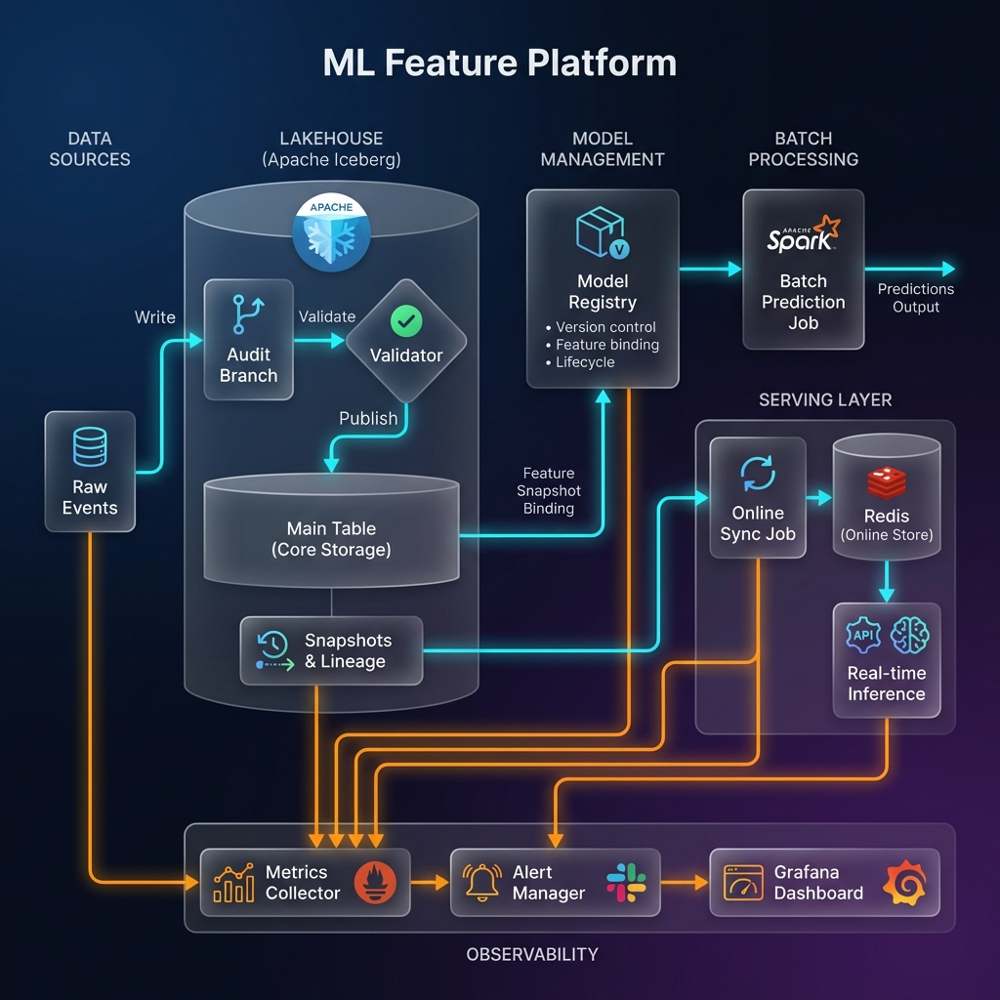

# Architecture Design

<div align="center">

</div>

---

## 1. Lakehouse Storage (Apache Iceberg)

We use Apache Iceberg as the unifying storage layer for all feature data.

### Why Iceberg?

| Feature | Benefit |
|---------|---------|
| **Snapshots** | Every commit creates an immutable snapshot for time travel |
| **Partitioning** | Hidden partitioning (e.g., by Day) enables efficient backfills |
| **Branching & Tagging** | Supports sophisticated lifecycles like WAP (Write-Audit-Publish) |
| **Schema Evolution** | Add/rename columns without rewriting data |
| **ACID Transactions** | Concurrent reads/writes with serializable isolation |

---

## 2. Feature Backfill Strategy (WAP Pattern)

We implement the **Write-Audit-Publish (WAP)** pattern to ensure zero dirty data in production.

```
┌─────────────────┐     ┌─────────────────┐     ┌─────────────────┐
│    WRITE        │────▶│    AUDIT        │────▶│    PUBLISH      │
│  Audit Branch   │     │   Validation    │     │  Fast-Forward   │
└─────────────────┘     └─────────────────┘     └─────────────────┘
        │                       │                       │
        ▼                       ▼                       ▼
   Isolated writes         Data quality            Atomic merge
   to branch only          checks pass?            to main branch
```

### Workflow
1. **Branch Creation**: `audit_<run_id>` branch created
2. **Write Isolation**: Data written to branch only
3. **Automated Audit**: Validation runs on branch (null rates, distributions)
4. **Publish**: `fast_forward` main to branch if valid

### Versioning & Lineage
Every Iceberg snapshot contains:
- ✅ Git Commit Hash
- ✅ Unique Run ID
- ✅ Pipeline User
- ✅ Timestamp

```sql
-- Time Travel Query
SELECT * FROM features FOR SYSTEM_VERSION AS OF '2023-01-01 10:00:00'

-- View Lineage
SELECT committed_at, 
       summary['spark.snapshot-property.code-version'] as git_hash,
       summary['spark.snapshot-property.run-id'] as run_id 
FROM features.snapshots
```

---

## 3. Model Registry

Centralized model versioning with **feature-data lineage binding**.

### Key Features

| Feature | Description |
|---------|-------------|
| **Semantic Versioning** | Automatic version bumping (1.0.0 → 1.0.1) |
| **Feature Snapshot Binding** | Links model to Iceberg snapshot used for training |
| **Lifecycle Management** | None → Staging → Production → Archived |
| **Artifact Storage** | SHA256-verified model file storage |
| **Lineage Tracking** | Complete code + data lineage for reproducibility |

### Model Lifecycle

```
┌─────────┐     ┌─────────┐     ┌────────────┐     ┌──────────┐
│  NONE   │────▶│ STAGING │────▶│ PRODUCTION │────▶│ ARCHIVED │
└─────────┘     └─────────┘     └────────────┘     └──────────┘
      │               │                │
      ▼               ▼                ▼
  Registered     Validated         Serving
  & tracked      for release       in prod
```

### Integration Points
- **Batch Prediction Job**: Loads model by name/version
- **Online Serving**: Production model auto-discovery
- **Iceberg Snapshots**: Feature snapshot binding for reproducibility

---

## 4. Batch Prediction

Spark-based batch inference pipeline with full lineage tracking.

### Data Flow

```
┌─────────────────┐     ┌─────────────────┐     ┌─────────────────┐
│  Model Registry │────▶│  Batch Predict  │────▶│   Predictions   │
│  (Load Model)   │     │  (Spark UDF)    │     │  (Iceberg Table)│
└─────────────────┘     └─────────────────┘     └─────────────────┘
                               ▲
                               │
                        ┌──────┴──────┐
                        │ Feature Table│
                        │  (Iceberg)   │
                        └─────────────┘
```

### Features
- **Registry Integration**: Auto-loads production or specified model version
- **Feature Auto-loading**: Reads from Iceberg feature tables
- **Lineage Columns**: Predictions include model_version, feature_snapshot, run_id
- **Multi-format Support**: pickle, ONNX, TorchScript

---

## 5. Serving Layer (Batch-Stream Consistency)

Unified source of truth with incremental online sync.

### Architecture

| Component | Purpose |
|-----------|---------|
| **Iceberg (Main Table)** | Single source of truth for validated features |
| **OnlineSyncJob** | Incremental delta reads using `start-snapshot-id` |
| **Redis** | Low-latency feature serving for real-time inference |

### Sync Strategy
```python
# Incremental read from last synced snapshot
changes_df = spark.read.format("iceberg") \
    .option("start-snapshot-id", last_synced_snapshot) \
    .load(table_name)

# Upsert to online store
online_store.batch_write(changes_df)
```

---

## 6. Monitoring & Alerting

Production-grade observability for ML pipelines.

### Metrics Collection (Prometheus-compatible)

| Metric Type | Examples |
|-------------|----------|
| **Counter** | predictions_total, job_success_total, job_failure_total |
| **Gauge** | feature_null_rate, prediction_mean, model_age_hours |
| **Histogram** | prediction_latency_seconds (P50/P95/P99) |

### Pre-built Alert Rules

| Alert | Threshold | Severity |
|-------|-----------|----------|
| `high_feature_null_rate` | > 10% | ⚠️ Warning |
| `prediction_latency_high` | P99 > 500ms | 🔴 Error |
| `job_failure_spike` | > 3 failures | 🚨 Critical |
| `feature_drift_detected` | Drift score > 0 | ⚠️ Warning |
| `online_store_empty` | 0 keys | 🚨 Critical |
| `model_too_old` | > 1 week | ℹ️ Info |

### Notification Channels
- **Console**: Development/debugging
- **File**: Audit trail (JSONL format)
- **Slack**: Production alerts (webhook integration)

---

## 7. Maintenance & Operations

Automated optimization to keep the Lakehouse performant.

| Operation | Purpose | Frequency |
|-----------|---------|-----------|
| `rewrite_data_files` | Compact small files into larger read-optimized files | Weekly/After heavy writes |
| `expire_snapshots` | Remove history older than N days (default 7) | Daily |
| `remove_orphan_files` | Delete unreferenced data files | Weekly |

---

## 8. Directory Structure

```
src/
├── jobs/
│   ├── backfill_job.py         # Main WAP engine
│   ├── online_sync_job.py      # Incremental Redis sync
│   ├── maintenance_job.py      # Compaction & expiration
│   └── batch_predict_job.py    # Spark batch inference
│
├── model/
│   └── registry.py             # Model Registry with lineage
│
├── monitoring/
│   ├── metrics.py              # Prometheus metrics collector
│   └── alerts.py               # Rule-based alerting engine
│
├── features/
│   └── user_features.py        # Feature definitions
│
├── validation/
│   └── validator.py            # Data quality checks
│
├── serving/
│   └── online_store.py         # Redis client wrapper
│
└── common/
    ├── spark_utils.py          # Spark session factory
    └── git_utils.py            # Git lineage utilities
```

---

## 9. Future Enhancements

| Enhancement | Description |
|-------------|-------------|
| **Grafana Dashboards** | Pre-built templates for latency, throughput, data quality |
| **Feature SDK** | Python DSL for declarative feature definitions |
| **Schema Registry** | Automated schema evolution validation |
| **Kubernetes Deployment** | Helm charts for production deployment |
